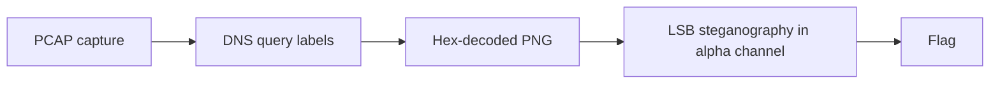

## Challenge Overview

`Whisper Net` provides a single 40MB packet capture and a prompt: *"Something
left the network, and it wasn't loud about it."* No further hints. The
goal is to recover an exfiltrated file hidden inside otherwise
unremarkable traffic.

<div class="ctf-filetree">whisper_net/
└── capture.pcapng
</div>

## Initial Triage

Opening the capture in Wireshark and filtering by protocol shows an
overwhelming amount of ordinary traffic — HTTP, TLS, and a steady trickle
of DNS queries to a single external resolver.

```console
$ tshark -r capture.pcapng -q -z io,phs
Protocol Hierarchy
===================
frame                    frame.len:812400
  eth                    eth.len:812400
    ip                   ip.len:812400
      tcp                tcp.len:640210
      udp                udp.len:172190
        dns              dns.len:172190
```

!!! info "Volume anomaly"
    DNS traffic alone is over 170KB — far more than a normal browsing
    session would generate. That's the first signal something is being
    tunneled through DNS.

## Extracting the DNS Tunnel

Pulling every queried subdomain out of the capture:

```console
$ tshark -r capture.pcapng -Y dns.flags.response==0 -T fields -e dns.qry.name \
    | sort -u | head -5
4a6f686e.exfil.cylab
2073656e.exfil.cylab
742e2e2e.exfil.cylab
...
```

Each label decodes cleanly as hex, which reconstructs into readable
bytes once concatenated in query order — but the plaintext result is
itself another layer, not the flag:

```console
$ python3 decode_labels.py capture.pcapng > stage1.bin
$ file stage1.bin
stage1.bin: PNG image data, 512 x 512, 8-bit/color RGBA
```

## The Image Is Not the Payload

The extracted PNG looks like an ordinary gradient image at first glance —
but the challenge name is a hint in itself.

!!! warning "Don't stop at the first artifact"
    A recovered file that "looks complete" is not the same as a
    recovered file that's *done*. Whisper Net rewards checking whether
    the extracted artifact itself carries a second layer.

Running a standard LSB steganography check against the PNG's alpha
channel reveals embedded data:

```console
$ zsteg stage1.bin | grep -i "text\|data"
b1,rgba,lsb,xy       .. text: "CyLab{tunnels_within_tunnels}"
```

## Full Chain Summary



<details class="ctf-spoiler">
  <summary>Hint — if the DNS decode looks garbled</summary>
  <div class="ctf-spoiler__body">
    Query order matters. DNS responses can arrive out of order relative
    to the underlying byte stream if the capture spans multiple TCP
    retransmission windows — sort by timestamp, not by packet number.
  </div>
</details>

## Flag

```
CyLab{tunnels_within_tunnels}
```

## Takeaways

- DNS tunneling is a quiet, high-volume signal — protocol hierarchy
  statistics are often the fastest way to spot it in a large capture.
- Extracted artifacts should be treated as new evidence, not a finish
  line — always re-run basic triage (`file`, `binwalk`, `zsteg`/`stegsolve`)
  on anything you pull out of a capture.
- Layered challenges reward systematic re-triage over trying to guess
  the "final" trick up front.
