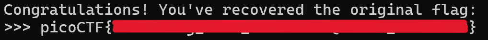

## Challenge Overview

In this challenge we need to connect to a netcat server and reveres the given string to get the flag, On connecting to the given netcat address the instruction provided are:

```yaml
===Welcome to the Text Transformations Challenge!===

Your goal: step by step, recover the original flag.
At each step, you'll see the transformed flag and a hint.
Enter the correct Linux command to reverse the last transformation.
```
##Step By Step solution

###Step 1: Base64 reverse
```yaml
Current flag: KTBxcDI0bnIwLWZhMDFnQHplMHNmYTRlRy1nazNnLXRhMWZlcmlyRShTR1BicHZj
Hint: Base64 encoded the string.
Enter the Linux command to reverse it:
```

Linux command to reverse base64 is:

```yaml
base64 -d
```

###Step 2: Reversing the string
```yaml
Current flag: )0qp24nr0-fa01g@ze0sfa4eG-gk3g-ta1ferirE(SGPbpvc
Hint: Reversed the text.
Enter the Linux command to reverse it:
```
Linux command to reverse is:

```yaml
rev
```

###Step 3:Replacing Dashes
```yaml
Current flag: cvpbPGS(Eriref1at-g3kg-Ge4afs0ez@g10af-0rn42pq0)
Hint: Replaced underscores with dashes.
Enter the Linux command to reverse it:
```
To replace tokens we use 'tr' command in linux. The command to replace underscores with dashes is:

```yaml
tr '-' '_'
```

###step 4: Replacing braces
```yaml
Current flag: cvpbPGS(Eriref1at_g3kg_Ge4afs0ez@g10af_0rn42pq0)
Hint: Replaced curly braces with parentheses.
Enter the Linux command to reverse it:
```

We will use 'tr' again:

```yaml
tr '()' '{}'
```

###Step 5: Reversing ROT13
```yaml
Current flag: cvpbPGS{Eriref1at_g3kg_Ge4afs0ez@g10af_0rn42pq0}
Hint: Applied ROT13 to letters.
Enter the Linux command to reverse it:
```
ROT13 can be reversed using Linux command:

```yaml
tr 'A-Za-z' 'N-ZA-Mn-za-m'
```

##Flag


## Takeaways

- Base64 encoded string can be decoded using 'base64 -d'
- Any string can be reversed using 'rev'
- To replace tokens in a string we use 'tr'
- ROT13 can be reversed using tr 'A-Za-z' 'N-ZA-Mn-za-m
